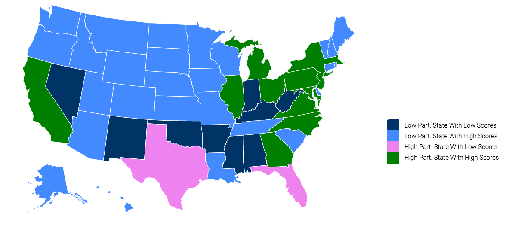

# College Board Statistic Analysis

For a better viewing experience, view the <a href="https://ronakshah.net/collegeboard-stats">live site</a>

## Conclusion

From analyzing both maps, I found that there was a inverse correlation between states with low AP enrollment and states with high AP Scores.

I started off by looking at the participation map. Noticing that the majority of the nation had low AP Participation, I wondered what scores these states were getting. Resultingly, I created another map to analyze the scores. College Board however, does not give specific scores for each state - instead they simply give percentages of students that scored a 3 or above (passing). Putting the two maps side by side, I noticed that many of the states with low populations were scoring high. Intrigued, I decided to combine the two maps together. 

In this map, I plotted all states with low participation and low scores to be dark blue, and states with low participation and high scores to be light blue. For the high population states, I used green to represent high scoring states and violet for high participation states with low scores.

</img>